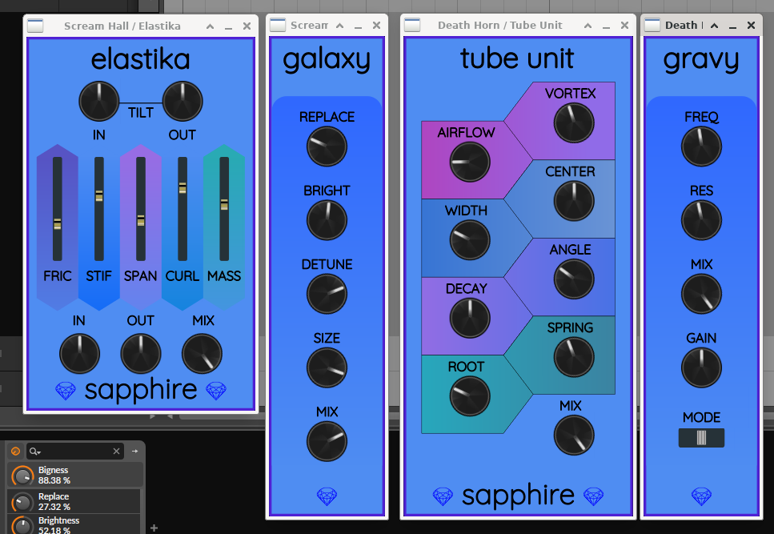

# Sapphire

CLAP-first tech, bringing the Sapphire DSP to your DAW.

To build

```bash
git clone https://github.com/baconpaul/sapphire-plugins
cd sapphire-plugins
git submodule update --init --recursive
cmake -Bignore/bld -DCMAKE_BUILD_TYPE=Release
cmake --build ignore/bld --target sapphire-plugins_all
```

If you don't want to copy the built plugins (mac/lin) after build do

```
cmake -Bignore/bld -DCMAKE_BUILD_TYPE=Release -DCOPY_AFTER_BUILD=FALSE
```

and then install the resulting artifact by hand.

The following Sapphire modules are included:

- **Elastika**: physical simulation of balls and springs
- **Galaxy**: a port of the Airwindows Galactic algorithm
- **Gravy**: a simple stereo filter with frequency and resonance controls. Works in lowpass, bandpass, and highpass modes.
- **Tube Unit**: a stereo tubular resonance thing. Great for making weird noises!

A screenshot of all four running inside Bitwig Studio:


